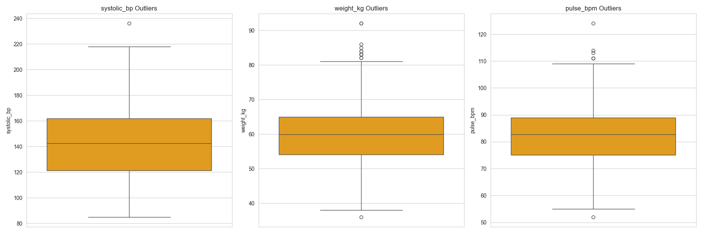
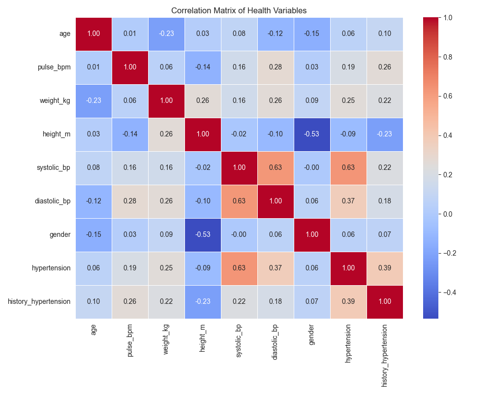
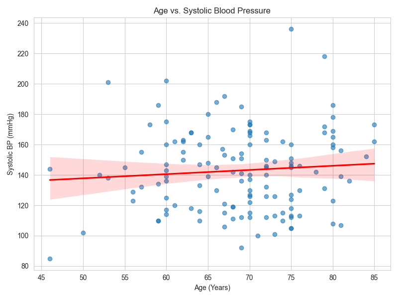
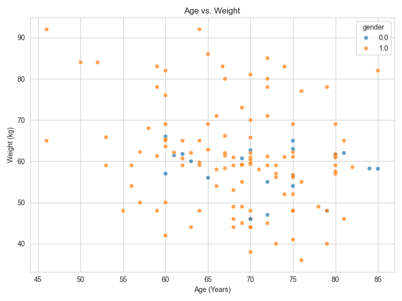
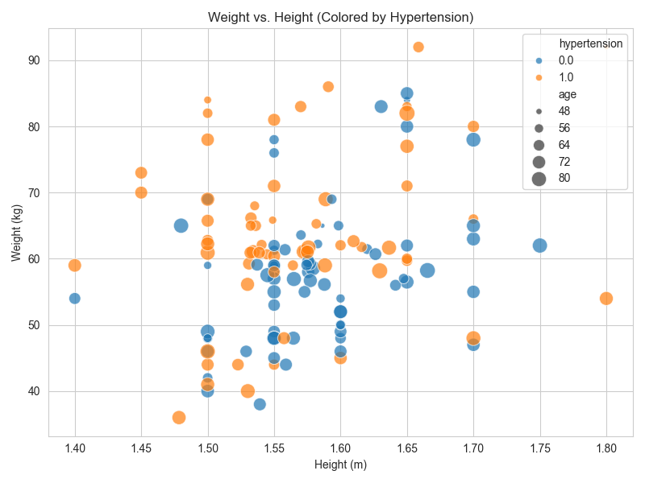
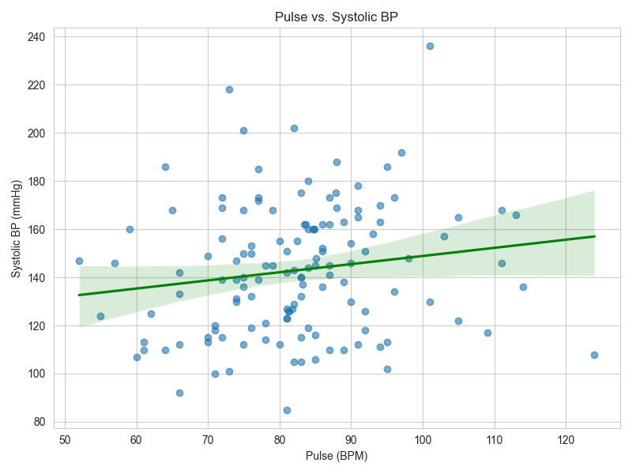
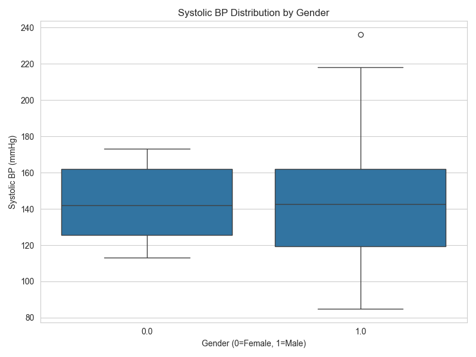

# 📂 Dataset Documentation

## Source

This dataset originates from a specialised clinic for the **Aged and Widowed**,
located at the **Ibadan North East Local Government Secretariat**, Ibadan, Oyo
State, Nigeria.

**Privacy & Compliance:**

* **Permission:** Explicit permission for data usage was granted by the Officer
in Charge.
* **De-identification:** Per the strict conditions of the data release, all
records were fully de-identified. No Direct Identifiers (names, addresses, phone
numbers) are present in this repository.
* **Scope:** The dataset represents a cohort of **$N=134$** geriatric patients.

---

## Extraction Pipeline

The original source data consisted of **unstructured written clinical texts**.
Images of these texts were taken. To transform this into the tabular format
found in `raw_data.csv`, a privacy-first extraction pipeline was employed:

1. **Physical Redaction:** Source images were cropped and redacted to remove
personal details *before* any processing.
2. **Manual Extraction (High Sensitivity):** Variables carrying the highest
re-identification risk (specifically **Age** and **Gender**) were extracted
solely via manual review to ensure zero leakage of PII.
3. **AI-Assisted Extraction:** Clinical variables (e.g., Blood Pressure,
History) were extracted using OCR and NLP techniques, followed by a
**Human-in-the-Loop (HITL)** review process to correct extraction errors.

---

## Data Dictionary

The following variables are present in the processed dataset.

<!-- markdownlint-disable MD013 -->
| Variable Name | Data Type | Unit | Description |
| :--- | :--- | :--- | :--- |
| `systolic_bp` | Float | mmHg | Systolic Blood Pressure |
| `diastolic_bp` | Float | mmHg | Diastolic Blood Pressure |
| `history_hypertension` | Categorical | -1/0/1 | History of Hypertension (1=Yes, 0=No, -1=Missing) |
| `age` | Integer | Years | Patient Age |
| `weight_kg` | Float | kg | Weight |
| `height_m` | Float | m | Height |
| `pulse_bpm` | Integer | bpm | Pulse Rate |
| `hypertension` | Binary | 0/1 | Target Variable: Hypertension Status (1=Yes, 0=No) |
<!-- markdownlint-enable MD013 -->

> *Note: Full details on encoding (e.g., 0=No, 1=Yes) can be found in the
[preprocessing notebook](../notebooks/01_preprocessing.ipynb).*

---

## 📊 Statistics & Missingness

Before imputation, the dataset exhibited significant missingness,
characteristic of paper-based records in resource-constrained settings.

### 1. Distribution (Encoded Data)

*Summary statistics of the encoded data (features with missing values).*

<!-- markdownlint-disable MD013 -->
| Statistic | Age | Weight (kg) | Height (m) | Systolic BP | Diastolic BP | Pulse |
| :--- | :--- | :--- | :--- | :--- | :--- | :--- |
| **Mean** | 68.7 | 60.6 | 1.6 | 142.9 | 84.9 | 82.4 |
| **Std Dev** | 8.1 | 11.7 | 0.1 | 26.7 | 13.5 | 12.4 |
| **Min/Max** | 46-85 | 36-92 | 1.40-1.80 | 85-236 | 56-122 | 52-124 |
<!-- markdownlint-enable MD013 -->

**Class Balance:** The dataset is fairly balanced with **53% Controls** (No
Hypertension) and **47% Cases** (Hypertension).

### 2. Missingness Profile (Encoded Data)

*Visualizing the sparsity of the original $N=134$ records.*

* *Note the high missingness in History (~60%) and Weight (~30%).*

### 3. Distribution (Imputed Data)

*Summary statistics of the final cleaned data used for generation.*

| Statistic | Age | Weight | Height (m) | Systolic BP | Diastolic BP | Pulse |
| :--- | :--- | :--- | :--- | :--- | :--- | :--- |
| **Mean** | 68.7 | 60.6 | 1.6 | 142.9 | 84.9 | 82.4 |
| **Std Dev** | 8.1 | 11.7 | 0.1 | 26.7 | 13.5 | 12.4 |
| **Min/Max** | 46-85 | 36-92 | 1.40-1.80 | 85-236 | 56-122 | 52-124 |

**Density Plots (Imputed Variables):**

---

### 4. Outlier Analysis

An IQR-based outlier analysis was conducted on the imputed dataset:

* **Systolic BP:** 1 outlier (236 mmHg).
* **Weight:** 12 outliers (Min 36kg).
* **Pulse:** 6 outliers (Max 124 bpm).

**Decision:** All outliers were retained. In a geriatric cohort, these extreme
values (e.g., very low weight) often represent **frail elderly patients** or
those in **hypertensive crisis**, rather than data errors. Removing them would
bias the model against the very high-risk groups we aim to protect.

**Outlier Boxplots:**

---

### 5. Exploratory Visualizations

We explored key relationships between health variables to understand the
dataset's structure.

#### Correlation Matrix

*Strong positive correlations observed between Systolic and Diastolic BP.*

#### Age Relationships

| Age vs. Systolic BP | Age vs. Weight |
| :---: | :---: |
|  |  |

* **Age vs BP:** Slight upward trend, consistent with geriatric physiology.
* **Age vs Weight:** No strong linear relationship.

#### Physical Metrics, Vitals

| Weight vs. Height | Pulse vs. BP |
| :---: | :---: |
|  |  |

* **Weight vs Height:** Positive correlation as expected.
* **Pulse vs BP:** Weak correlation.

#### Gender Distribution

*Comparison of Systolic BP distributions between genders.*

* **Females** have a slightly higher **Mean** Systolic BP (**143.1** vs 142.9
mmHg).
* **Males** have a slightly higher **Median** Systolic BP (**142.5** vs 142.0
mmHg).
They are **statistically almost identical** in terms of average
levels. However, the **Male** group shows significantly **higher variability**
(Standard Deviation: 27.8 vs 20.3), meaning you are more likely to see men with
extremely high (or low) blood pressure compared to women in this cohort.

---

## Processing Pipeline

### 1. Preprocessing & Exploration

Extensive cleaning was performed to handle the unstructured nature of the
source text.

* **Notebook:**
[notebooks/01_preprocessing_and_imputation.ipynb](../notebooks/01_preprocessing_and_imputation.ipynb)
* **Process:**
* **Dropping Columns:** Removed irrelevant columns (e.g., Rapid Diagnostic
Tests) not needed for the study.
* **Standardization:** Standardized categorical columns (e.g., Gender).
* **Splitting BP:** Split blood pressure into two separate variables:
`systolic_bp` and `diastolic_bp`.
* **Encoding:** Encoded categorical variables (e.g., History: Present=1,
Absent=0, Missing=-1).
* **Outlier Detection:** IQR-based analysis.

### 2. Imputation Strategy

Given the high missingness, simple deletion was impossible. We benchmarked
multiple imputation techniques (MICE, KNN, MissForest).

* **Conditional Imputation:** Logic was applied to ensure imputed Systolic BP
was always greater than Diastolic BP. (!!!need to confirm this)
* **Selected Method:** **MICE (Multivariate Imputation by Chained Equations)**
was chosen for its ability to preserve non-linear variance in geriatric data.
(!!! might need to add full imputation shootout method)
* **Imputed Variables:** Age, Pulse, Height, Weight, Systolic BP, Diastolic BP.

### 3. Feature Engineering

* **BMI Calculation:** Post-imputation, Body Mass Index (BMI) was calculated
using the formula:
$$BMI = \frac{Weight (kg)}{Height (m)^2}$$

### 4. Scaling

* **Method:** Standard Scaling (Z-score normalization) was applied after
imputation to ensure all features contributed equally to the model.

For the full preprocessing pipeline, see
[**Notebook**](../notebooks/01_preprocessing_and_imputation.ipynb).

---

## 📁 Directory Structure

* **`raw/`**: The structured data immediately after extraction (contains `NaN`
values).
* **`encoded/`**: The cleaned data after exploration and basic preprocessing.
* **`imputed/`**: The cleaned data after running MissForest Imputation (No
`NaN` values).
* **`synthetic_sample/`**: The augmented datasets generated by Gaussian copula
and CTGAN models.
