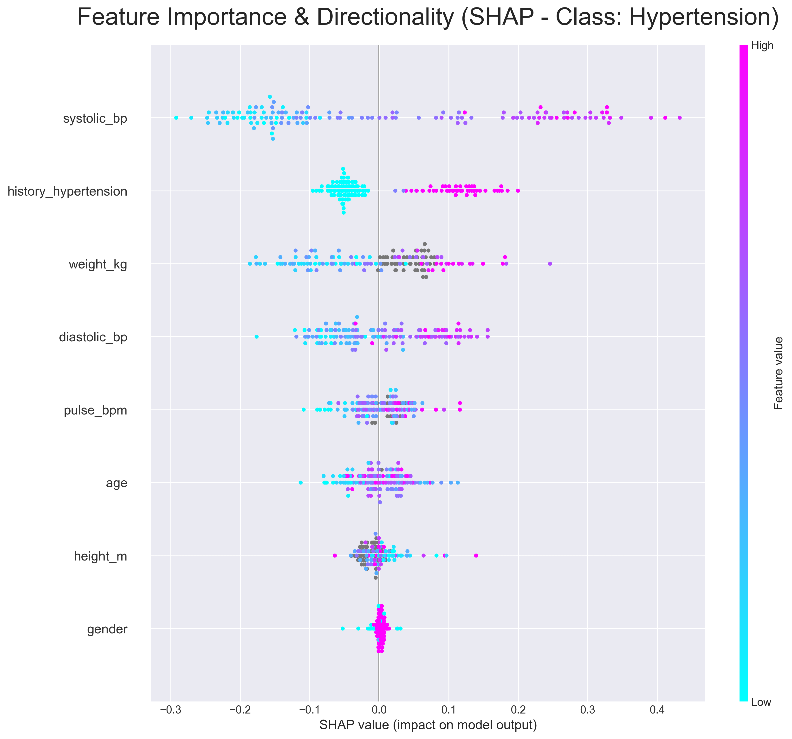
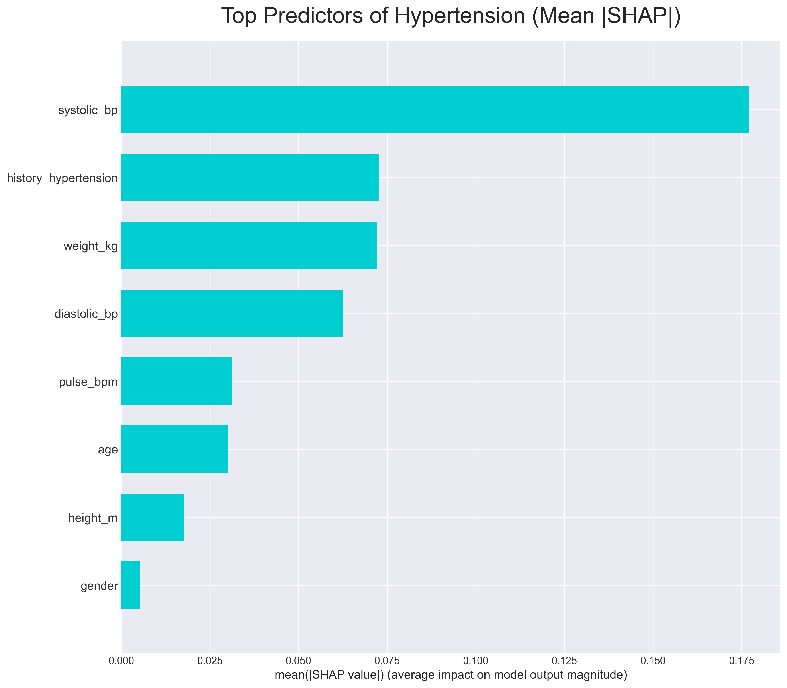

# Analysis Report

## Summary

Augmenting the real dataset with 50% synthetic data generated by Gaussian
Copula maintained baseline performance, whereas CTGAN degraded performance.
While it cannot yet fully replace real data 1:1 for this small dataset
($N=134$), the copula acts as a powerful regularizer.

[**SEE RAW RESULTS**](results/)

---

## 1. Utility Evaluation - Random Forest Classifier

### 1.1. Gaussian Copula Performance

*Performance of the Gaussian Copula generator across the four evaluation scenarios.*

<!-- markdownlint-disable MD013 -->
| Scenario | Description | F1-Score (Mean) | Accuracy (Mean) | AUC (Mean) |
| :--- | :--- | :--- | :--- | :--- |
| **A. Baseline** | Train Real, Test Real | **0.826** | 0.842 | 0.898 |
| **B. Fidelity** (1:1) | Train Synthetic, Test Real | 0.727 | 0.744 | 0.812 |
| **C. Scale** (n=1000) | Train Large Synthetic, Test Real | 0.750 | 0.765 | 0.865 |
| **D. Augment** | Train Real + Synthetic (50%), Test Real | **0.825** | **0.841** | **0.891** |
<!-- markdownlint-enable MD013 -->

**Interpretation:**

* **Fidelity:** The Copula model achieves ~88% of the baseline performance (0.
727 vs 0.826), indicating it captures the majority of the signal.
* **Augmentation:** Adding 50% synthetic data effectively matches the baseline
performance, suggesting it is a safe and high-quality augmentation source.

### 1.2. CTGAN Performance

*Performance of the CTGAN generator across the same scenarios.*

<!-- markdownlint-disable MD013 -->
| Scenario | Description | F1-Score (Mean) | Accuracy (Mean) | AUC (Mean) |
| :--- | :--- | :--- | :--- | :--- |
| **A. Baseline** | Train Real, Test Real | **0.826** | 0.842 | 0.898 |
| **B. Fidelity** | Train Synthetic, Test Real | 0.470 | 0.542 | 0.578 |
| **C. Scale** | Train Large Synthetic, Test Real | 0.458 | 0.546 | 0.555 |
| **D. Augment** | Train Real + Synthetic (50%), Test Real | 0.819 | 0.837 | 0.899 |
<!-- markdownlint-enable MD013 -->

**Interpretation:**

* **Fidelity:** CTGAN fails significantly (F1 0.470), performing little better
than random chance. This confirms the "Small Data Wall" hypothesis—deep
learning models struggle to converge on small datasets ($N=134$).
* **Augmentation:** It slightly degrades performance (0.819 vs 0.826), likely
by introducing noise.

*Comparing the two generators on key metrics for the top scenario - 50% augmentation.*

<!-- markdownlint-disable MD013 -->
| Metric | Gaussian Copula | CTGAN | Winner |
| :--- | :--- | :--- | :--- |
| **Privacy (DCR)** | **High** (No memorization) | **High** (No memorization) | Tie |
| **Fidelity (Scenario B)** | **0.727** | 0.470 | **Copula** |
| **Augmentation (Scenario D)** | **0.825** | 0.819 | **Copula** |
| **Training Stability** | Stable | Unstable | **Copula** |
<!-- markdownlint-enable MD013 -->

**Implication:** Gaussian Copula is the clear winner for this dataset size. It
offers far superior utility and fidelity while maintaining equal privacy standards.

### 1.3. Scale (Scenario C)

*Does generating SIGNIFICANTLY LARGER synthetic data help?*

* **Performance:** F1 Score remained at **0.750** (RF).
* **Interpretation:** Simply generating more data (N=1000) did not fix the
fidelity gap. The generator has learned "smooth" distributions and cannot
recover the sharp decision boundaries of the real data.

---

## 1.4. Augmentation (Scenario D)

*Does mixing Real + Synthetic help? We tested four "baby scenarios" with
different augmentation ratios.*

### 1.4.1. Gaussian Copula Augmentation

*Performance of Random Forest when augmented with Copula data.*

<!-- markdownlint-disable MD013 -->
| Ratio | Description | F1-Score | Accuracy | AUC | Note |
| :--- | :--- | :--- | :--- | :--- | :--- |
| **0.5** | 50% Synthetic Added | **0.825** | **0.841** | **0.891** | Matches baseline. |
| **1.0** | 100% Synthetic Added | 0.820 | 0.833 | 0.893 | Slight drop, but still competitive. |
| **2.0** | 200% Synthetic Added | 0.794 | 0.812 | 0.891 | Signal begins to dilute. |
| **4.0** | 400% Synthetic Added | 0.817 | 0.823 | 0.884 | Surprising recovery, but still below baseline. |
<!-- markdownlint-enable MD013 -->

### 1.4.2. CTGAN Augmentation

*Performance of Random Forest when augmented with CTGAN data.*

<!-- markdownlint-disable MD013 -->
| Ratio | Description | F1-Score | Accuracy | AUC | Note |
| :--- | :--- | :--- | :--- | :--- | :--- |
| **0.5** | 50% Synthetic Added | 0.819 | 0.837 | 0.899 | Best CTGAN result, but still degrades baseline. |
| **1.0** | 100% Synthetic Added | 0.806 | 0.827 | 0.889 | Clear downward trend. |
| **2.0** | 200% Synthetic Added | 0.771 | 0.800 | 0.880 | Significant loss of utility. |
| **4.0** | 400% Synthetic Added | 0.748 | 0.782 | 0.868 | The model is overwhelmed by low-fidelity data. |
<!-- markdownlint-enable MD013 -->

Unlike Copula, CTGAN never matches the baseline. Every synthetic record added
pulls the performance down, confirming its lower fidelity.

> **Caveat:** However, CTGAN actually achieved a slightly higher **AUC (0.899)**
> than Copula (0.891) in the 50% augmentation scenario. This suggests the deep
> learning model *did* learn valid global risk rankings (probability curves) but
> failed to sharpen the specific decision boundaries needed for high-precision
> diagnosis in such a small dataset.

---

## 2. Quantitative Fidelity (Copula)

2.1. **KS Test:** 0.92 means Excellent univariate fit. The shape of the
distributions in the synthetic data is statistically nearly identical to the
real data.

2.2. **Correlation Difference:** 0.89 means Good multivariate structure. The
generator successfully preserved the relationships between variables (e.g.,
higher BMI correlates with higher BP), though some minor noise was introduced.

2.3. **Discriminator AUC:** 0.64 (Hard to distinguish from real data). An AUC of
0.50 implies the data is "indistinguishable" (random guessing). An AUC of 1.00
implies "easily fake". A score of 0.64 indicates the synthetic data is
**realistic**, as the model struggles to reliably separate it from real patients.

---

## 3. Feature Importance Analysis

**Objective:** Validate that the "Augmented" model (RF + Copula) relies on
biologically valid signals.

### Top 3 Predictors

The SHAP analysis confirmed the model aligns with established medical literature:

1. **Systolic Blood Pressure** (Score: 0.177)
    * **Effect:** Strong Positive Correlation. Higher BP significantly
    increases the predicted risk of hypertension.
2. **History of Hypertension** (Score: 0.073)
    * **Effect:** Positive Correlation. Patients with a known history are
    correctly flagged as high-risk.
3. **Weight** (Score: 0.072)
    * **Effect:** Positive Correlation. Increasing weight acts as a secondary
    risk factor.

> **Conclusion:** The model has learned robust, causal relationships rather
than overfitting to noise, validating the quality of the synthetic augmentation.

## Research Conclusions

**1. Augmentation Maintained Utility:**
Augmenting the small real dataset with **50% synthetic data** generated by a
**Gaussian Copula** model maintained the baseline F1-Score (0.826)
while potentially increasing model robustness. This was the optimal strategy.

**2. Statistical Models Beat Deep Learning:**
For this small sample size, the statistical **Gaussian Copula** generator
significantly outperformed the deep learning-based **CTGAN**.

* **Copula:** Captured ~88% of the signal (Fidelity F1: 0.727).
* **CTGAN:** Failed to converge, performing near random chance (Fidelity F1:
0.470).

**3. Privacy is Preserved:**
Both generators successfully passed the Distance to Closest Record (DCR)
privacy audit, ensuring no real patient records were memorized or leaked.

**4. Fidelity is Maintained:**
The copula-generated synthetic data preserved 92% of univariate distributions
and 89% of correlation structures, while remaining realistically
indistinguishable from real patient records (Adversarial AUC 0.64).

**5. Limits of Synthetic Scaling:**
Contrary to the intuition that "more data is better," we found that:

* Aggressive augmentation (>100% synthetic data) degraded performance by
diluting the true signal.
* Training solely on synthetic data (1:1) yielded lower predictive power than
the baseline.
* Generating a larger dataset (e.g., N=1000) from this small seed did not
improve performance.
