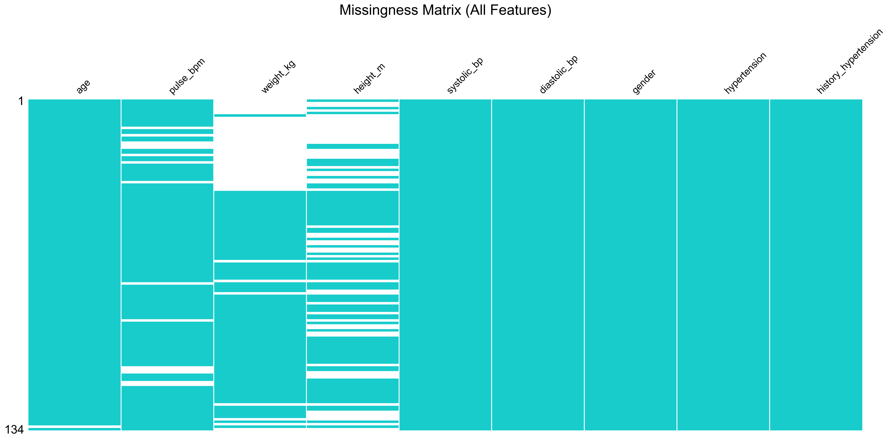

# Core Methodology

## Project Objective

The primary goal of this project was to evaluate the **Privacy, Fidelity,
and Utility** of synthetic data generated from a small, real-world clinical dataset
(N=134) focused on Hypertension prediction.

Given the small sample size, the methodology was designed to be statistically robust,
minimizing variance and preventing data leakage, to determine if synthetic data
could serve as a viable replacement or augmentation strategy.

---

> The dataset originates from a specialized clinic for the **Aged and
Widowed** in Ibadan, Nigeria. It represents a cohort of **N=134** geriatric patients.

For data extraction and preprocessing, see [Data Extraction & Preprocessing](../1_datasets/README.md).

---

## Phase 1: Data Imputation

**Objective:** Create a complete, high-quality dataset from the raw data containing
missing values.

### Missingness

### Imputation

To select the imputation method, we implemented a competitive
evaluation of three distinct techniques:

1. **MICE (Multivariate Imputation by Chained Equations):** A statistical
approach that models each feature as a function of others.
2. **KNN (K-Nearest Neighbors):** Imputes based on similarity to other patients.
3. **MissForest:** A Random Forest-based iterative imputer.

We used **5-Fold Stratified Cross-Validation** to evaluate each imputer's
impact on a downstream Random Forest classifier.

Winner: **MICE (`IterativeImputer`)**

**Density plots of imputed features**

> [**See Full Implementation**](../4_src/imputation.py)

---

## Phase 2: Data Generation

**Objective:** Generate privacy-preserving synthetic data that retains the
statistical properties of the real data.

### The `GeneratorWrapper`

We implemented a flexible `GeneratorWrapper` class in [**Generation.py**](../4_src/
generation.py) to
support multiple generator backends under a unified interface. This allowed for
fair, side-by-side comparison.

Generators evaluated:

<!-- markdownlint-disable MD013 -->
| Generator | Type | Hypothesis |
| :--- | :--- | :--- |
| **Gaussian Copula (SDV)** | Statistical Model | Best for small tabular data as it models correlations directly without needing massive training data. |
| **CTGAN** | Deep Learning (GAN) | State-of-the-art for large datasets, but likely to struggle with N=134 due to convergence issues. |
<!-- markdownlint-enable MD013 -->

### Privacy

Before any data was used for evaluation, it passed a **Privacy Check** in [**Generation.py**](../4_src/generation.py):

* **Metric:** Distance to Closest Record (DCR).
* **Threshold:** Min DCR > 0.01 (Ensures no exact matches/memorization).
* **Result:** Both generators passed, but for the final audit, we focused on the
**Gaussian Copula** (the winner). It showed a safe distance from real records
(Min DCR > 0.06), ensuring low leakage risk.

---

## Phase 3: Evaluation

**Objective:** Scientifically measure the quality
of the synthetic data.

### 3.1 Utilitiy

We compared the utility of the copula and CTGAN generated data
by performing a binary classification for hypertension using the `TRTR-TSTR`
framework on each dataset. To combat the high variance inherent
in small datasets, we
implemented a **Repeated Stratified K-Fold Cross-Validation** loop:

* **Splits:** 5 Folds.
* **Repeats:** 5 Times.
* **Total Runs:** 25 per model per scenario.

### Model Selection & Tuning

To ensure robustness, we did not rely on a single algorithm. We trained and tuned
four distinct classifiers using **RandomizedSearchCV**:

1. **Random Forest (RF):** Comparison of tree depth and estimators.
2. **XGBoost (XGB):** Gradient boosting with learning rate tuning.
3. **Logistic Regression (LR):** Linear baseline with regularization.
4. **K-Nearest Neighbors (KNN):** Distance-based baseline.

**Tuning Protocol:**

* **Search:** Randomized Search (5 Iterations).
* **Inner validation:** 3-Fold Cross-Validation.
* **Optimization Metric:** F1-Score.

### TRTR-TSTR

For each fold, we trained models under four distinct scenarios:

1. **Real Data Only**
2. **Synthetic Data Only**
3. **Real + Synthetic Data**
4. **Real + Synthetic Data (Augmented)**

**Metrics:**

* **A. F1-Score:** Primary metric because it balances Precision (avoiding false
alarms) and Recall (catching sick patients), which is critical
in healthcare where missing a diagnosis is dangerous.
* **B. Accuracy:** The percentage of correct predictions.
* **C. AUC:** A measure of the model's ability to distinguish between classes, i.e
hypertensive or not.

**Winner:** Random Forest with Gaussian Copula

### 3.2 Statistical Fidelity

To complement the predictive utility tests, we performed a standalone statistical
evaluation using a dedicated script, [**Fidelity.py**](../4_src/fidelity.py).

* **Data Source:** We trained the **Gaussian Copula** generator (the utility winner)
on the **entire real dataset (N=134)**. We then generated a fresh synthetic
dataset of identical size (N=134) for this comparison.
  * **Note:** This differs from the TRTR-TSTR Loop where we trained on subsets (folds).
Here, we assess the champion model's capacity to learn the *full* distribution.

* **Metrics & Interpretation:**

1. **Univariate Fidelity (KS Score):** Kolmogorov-Smirnov Test on continuous
variables (Age, BP, etc.). Measures the
shape overlap (**1.0** = Perfect Overlap, **0.0** = No Overlap).

2. **Multivariate Fidelity (Correlation Diff):** Measures the distance between
correlation matrices. Lower is better(closer to 0).

3. **Adversarial Fidelity (Discriminator AUC)
:** The score of a classifier trying to spot
fakes. **0.5 is Perfect** (Machine is guessing). **> 0.7** means variables are
leaking artifacts.

---

## Phase 4: Interpretability (Feature Importance)

**Objective:** Verify that the model is learning biologically plausible
relationships and not relying on artifacts, by analyzing the "Winning Model"
(Random Forest + Copula 50% Augmentation).

### Methodology: SHAP (Shapley Additive Explanations)

We used **SHAP**, a game-theoretic approach to explain the output of machine
learning models. Unlike standard feature importance (which only shows
magnitude), SHAP reveals **directionality** (e.g., does High BP increase or
decrease risk?).

* **Explainer:** `shap.TreeExplainer` (Optimized for Random Forest).
* **Target:** The probability of **Hypertension = Yes**.
* **Metric:** We analyzed both the mean absolute SHAP value (Global Importance)
and the beeswarm plot (Local Explanation) to audit the decision logic.

## Final Framework

For this specific project, the optimal utility framework is:

1. **Impute** using MICE.
2. **Generate** using Gaussian Copula.
3. **Augment** the training set by 50% (Ratio 0.5) for the final predictive model.

[**FOR FULL RESULTS AND INTEPRETATION, READ THE ANALYSIS REPORT.**](analysis_report.md)
