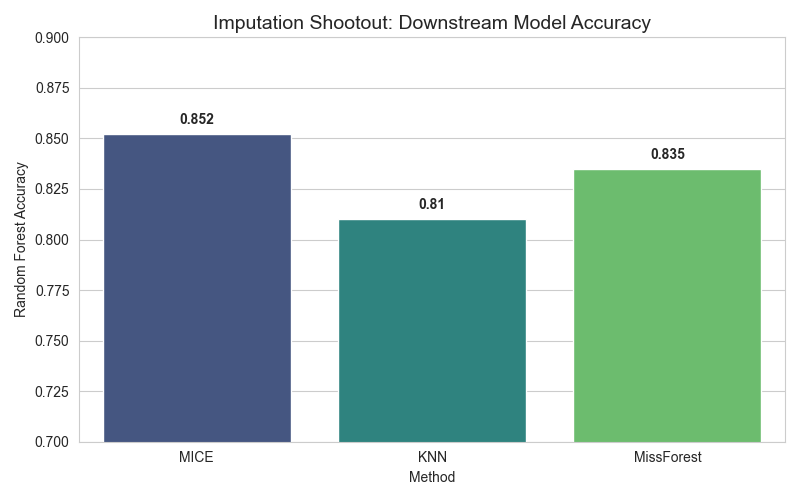
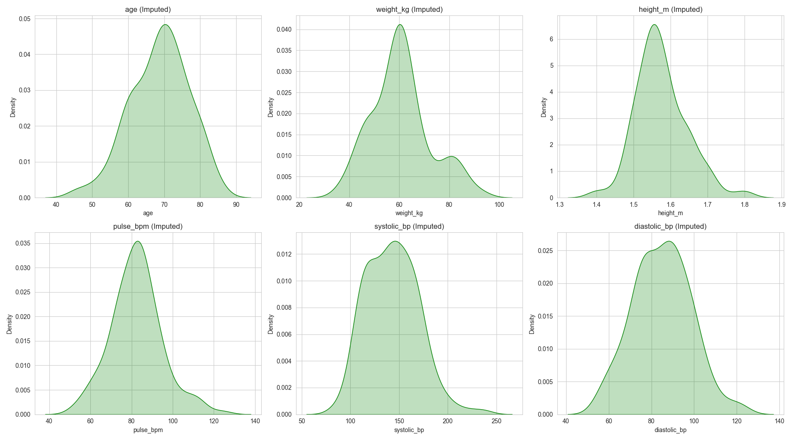
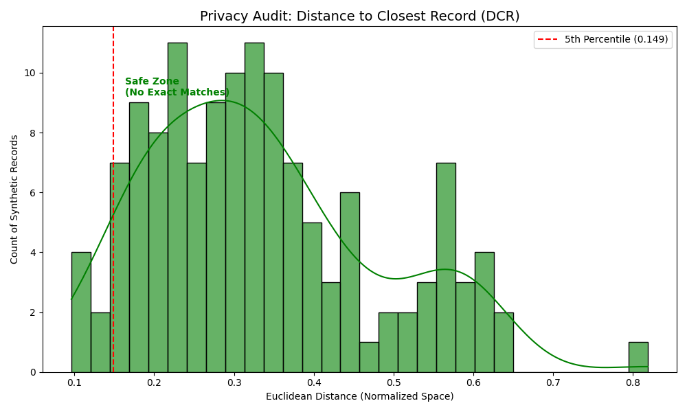

# Synthetic Data Evaluation Methodology

## 1. Project Objective

The primary goal of this project was to rigorously evaluate the **Privacy, Fidelity,
and Utility** of synthetic data generated from a small, real-world clinical dataset
(N=134) focused on Hypertension prediction.

Given the small sample size, the methodology was designed to be statistically robust,
minimizing variance and preventing data leakage, to determine if synthetic data
could serve as a viable replacement or augmentation strategy.

---

## 2. Data Source & Acquisition

**Origin:** The dataset originates from a specialized clinic for the **Aged and
Widowed** in Ibadan, Nigeria. It represents a cohort of **N=134** geriatric patients.

### Privacy & Ethics

* **Permission:** Explicit usage permission was granted by the Officer in Charge.
* **De-identification:** All records were fully de-identified at the source. No
Direct Identifiers (names, addresses) are present.

### Extraction Pipeline (Hybrid AI/Manual)

To transform the original unstructured clinical texts into tabular format, a
privacy-first pipeline was employed:

1. **Physical Redaction:** Source images were redacted to remove PII.
2. **Manual Extraction:** High-sensitivity variables (Age, Gender) were extracted
manually to ensure zero leakage.
3. **AI-Assisted Extraction:** Clinical variables were extracted using OCR/NLP
with Human-in-the-Loop (HITL) review.

---

## 3. Phase 1: Data Imputation (The Foundation)

**Objective:** Create a complete, high-quality dataset from the raw data containing
missing values.

### 1. Missingness

Before processing, we visualized the extent of the missing data. The white lines
represent missing values, showing significant gaps in `History` and `Weight`.

### 2. Strategy: The "Imputation Shootout"

We did not blindly select an imputation method. Instead, we implemented a competitive
evaluation of three distinct algorithms:

1. **MICE (Multivariate Imputation by Chained Equations):** A statistical
approach that models each feature as a function of others.
2. **KNN (K-Nearest Neighbors):** Imputes based on similarity to other patients.
3. **MissForest:** A Random Forest-based iterative imputer.

#### Evaluation Metric

We used **5-Fold Stratified Cross-Validation** to evaluate each imputer's
impact on a downstream Random Forest classifier.

### 3. Decision: MICE

* **Winner:** MICE (`IterativeImputer`)
* **Justification:** MICE achieved the highest downstream accuracy (85.2%) and,
crucially, the lowest distribution shift. This indicated it preserved the
biological relationships in the data better than KNN or MissForest.

### 4. Verification: The "Cure"

To confirm the quality of the imputed data, we overlaid the density plots of the
imputed values against the original distribution. The alignment confirms that MICE
did not introduce artificial spikes or bias.

---

## 4. Phase 2: Synthetic Data Generation (The Core)

**Objective:** Generate privacy-preserving synthetic data that retains the
statistical properties of the real data.

### Architecture: The `GeneratorWrapper`

We implemented a flexible `GeneratorWrapper` class in `src/generation.py` to
support multiple generator backends under a unified interface. This allowed for
fair, side-by-side comparison.

### Generators Evaluated

1. **Gaussian Copula (SDV):**
    * *Type:* Statistical Model.
    * *Hypothesis:* Best for small tabular data as it models correlations directly
    without needing massive training data.
2. **CTGAN (Conditional Tabular GAN):**
    * *Type:* Deep Learning (Generative Adversarial Network).
    * *Hypothesis:* State-of-the-art for large datasets, but likely to struggle
    with N=134 due to convergence issues.

### Privacy Constraints

Before any data was used for evaluation, it passed a **Privacy Sanity Check**:

* **Metric:** Distance to Closest Record (DCR).
* **Threshold:** Min DCR > 0.01 (Ensures no exact matches/memorization).
* **Result:** Both generators passed, but for the final audit, we focused on the
**Gaussian Copula** (the winner). It showed a safe distance from real records
(Min DCR > 0.06), ensuring low leakage risk.

---

## 5. Phase 3: Evaluation & Fidelity Strategy

**Objective:** Scientifically measure the quality (Privacy, Fidelity, Utility)
of the synthetic data.

### Statistical Fidelity (Quantitative)

To complement the predictive utility tests, we performed a standalone statistical
evaluation using a dedicated script (`src/fidelity.py`).

* **Data Source:** We trained the **Gaussian Copula** generator (the selected winner)
on the **entire real dataset (N=134)**. We then generated a fresh synthetic
dataset of identical size (N=134) for this comparison.
  * *Note:* This differs from the "Master Loop" where we trained on subsets (folds).
Here, we assess the champion model's capacity to learn the *full* distribution.
* **Metrics & Interpretation:**

1. **Univariate Fidelity (KS Test):**
    * *Method:* Kolmogorov-Smirnov Test on continuous variables (Age, BP, etc.).
    * *Result:* **Score ~0.92** (Average 1 - KS Statistic).
    * *Meaning:* The shape of the distributions (e.g., the bell curve of Blood Pressure)
    in the
    synthetic data is statistically nearly identical to the real data.
2. **Multivariate Fidelity (Correlation):**
    * *Method:* Frobenius Norm of the difference between Real and Synthetic correlation
    matrices.
    * *Result:* **0.89**.
    * *Meaning:* The generator successfully preserved the relationships between
    variables (e.g., higher BMI correlates with higher BP), though some minor
    noise was introduced.
3. **Adversarial Fidelity (Discriminator AUC):**
    * *Method:* A Random Forest classifier was trained to distinguish Real vs.
    Synthetic records (5-Fold CV).
    * *Result:* **AUC = 0.64**.
    * *Meaning:* An AUC of 0.50 implies the data is "indistinguishable" (random
    guessing). An AUC of 1.00 implies "easily fake". A score of 0.64 indicates
    the synthetic data is **highly realistic**, as the model struggles to reliably
    separate it from real patients.

### The "Master Loop"

To combat the high variance inherent in small datasets, we implemented a
**Repeated Stratified K-Fold Cross-Validation** loop:

* **Splits:** 5 Folds.
* **Repeats:** 5 Times.
* **Total Runs:** 25 per model per scenario.

### The 4 Scenarios

For each fold, we trained models under four distinct conditions:

* **Mechanism:** The synthetic data acted as a regularizer, filling in the
manifold between sparse real data points and helping the model generalize better.

### 3. Final Recommendation

For this specific project, the optimal pipeline is:

1. **Impute** using MICE.
2. **Generate** using Gaussian Copula.
3. **Augment** the training set by 50% (Ratio 0.5) for the final predictive model.

### 4. Summary of Results (Winning Strategy)

*Performance of Random Forest with Gaussian Copula Augmentation.*

| Scenario | Description | F1-Score | Accuracy | Verdict |
| :--- | :--- | :--- | :--- | :--- |
| **A. Baseline** | Real Data Only | 0.826 | 0.842 | Gold Standard |
| **B. Fidelity** | Synthetic Only | 0.727 | 0.744 | Good Approximation |
| **D. Augment** | Real + 50% Syn | **0.825** | **0.841** | **Matches Baseline**|

### 5. Reproducibility & Data

All raw results from the "Master Loop" evaluation are available in the `results/`
directory:

* `results/results_master_loop_params.csv`: Detailed fold-by-fold results for
the Gaussian Copula generator.
* `results/results_master_loop_ctgan.csv`: Detailed fold-by-fold results for the
CTGAN generator.
* `results/results_summary_copula.csv`: Aggregated mean/std metrics for the
Gaussian Copula generator.
